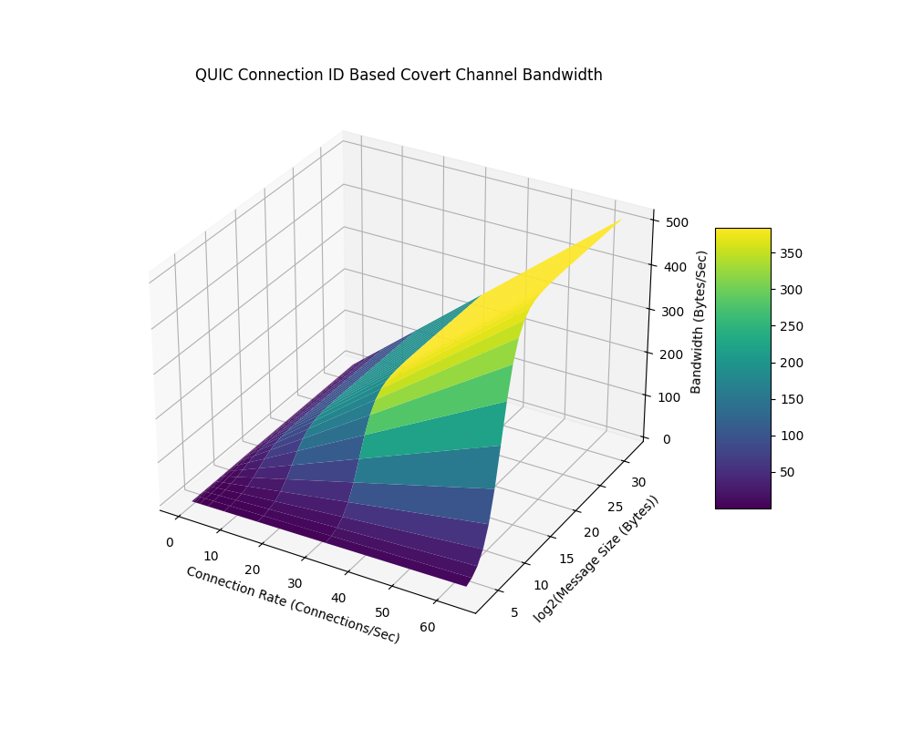

In this paper a covert channel exploiting headers in the QUIC protocol is
described and demonstrated. Many header values are randomly chosen and are
specified to require high entropy values for security considerations. These
headers provide a storage channel for high entropy data such as encrypted or
compressed data to be transmitted in ways that evade detection. The primary
challenge of developing such a covert channel is ensuring all headers used
conform to the entropy requirements of the protocol specification. This
includes ensuring that key distribution and encrypted packets are
indistinguishable from random high entropy values. An implementation of this
covert channel was constructed and demonstrated. Detection and disruption
vectors are also enumerated.

# Introduction

The Quick UDP Internet Connections (QUIC) protocol was proposed by J. Roskind
as an alternative to TCP. The goals of the protocol were to make an alternative
protocol which could be deployed broadly, reduce head-of-line blocking, reduce
round trip time (RTT), improve efficiency of mobile device connections, reduce
congestion from sources and sinks with asymmetric performance, comparable
privacy assurance to TLS, reliable and scalable server and client resource
requirements, reducing bandwidth, reducing packet count, support of reliable
transport of multiplex streams, efficient demux/mux for proxies, and to reuse
or revise existing protocols [1].

To do this, QUIC operates directly over UDP, which allows it to avoid some of
TCP's initial connection setup delays. QUIC uses encryption to securely
establish a connection between a client and a server. It combines the handshake
and encryption setup into a single step to reduce latency. Once connected, QUIC
can transmit data using multiplexing allowing one to send multiple streams of
data simultaneously over a single connection. QUIC also includes built-in
mechanisms for error correction and congestion control, ensuring reliable and
efficient data transfer even in less stable network conditions such as mobile
device connections.

# Motivations

While QUIC protocol connections are often protected with TLS 1.3 [4] some
nation states block foundational features of TLS 1.3 such as ESNI [7].
Additionally, nation state actors and organizations implement TLS inspection
firewalls or proxies [9] or execute deliberate MITM attacks by creating their
own certificate authority and requiring its installation on assets in the scope
of their interest. Such techniques can be used legitimately for data loss
prevention as well as censorship or acts of espionage. An example of an
attempted MITM attack was conducted in 2014 when China replaced legitimate
certificates with self-signed certificates [8]. This attempt did not use a
trusted CA and was transparent, but proper implementations of TLS inspection
will not be apparent to the user.

In this context, we cannot rely on protocols like TLS 1.3 which depends on
verifying the trustworthy nature of certificates used to negotiate and encrypted
connection. We must assume all packets are visible in clear text to a passive
or active warden. To do this we need to hide communications in fields which
a passive warden would not be able to distinguish from benign traffic and
in a way where manipulation of the passed messages is not possible.

# Overview

The QUIC protocol is defined in RFC 9000 [2], RFC 8999 [3], RFC 9001 [4], RFC 
9002 [5], and QUIC v2 extends these specifications in RFC 9369[6]. In particular
RFC 9000 defines the base protocol which provides us a reference to what fields
in protocol headers may be useful for a covert channel.

## Connection ID

Each connection in the QUIC protocol has a unique connection ID to ensure
connections can be correlated even if there are changes in lower protocols such
as UDP and IP. This field requires that related connections cannot be correlated
by their connection IDs [2, Section 5.1] and, in the context of address
validation, that connection IDs must have at least 64 bits of entropy
[2, Section 8.1].

## Address Validation Token 

Address validation tokens are an optional field that can be provided by a server
and used in validating subsequent connections [2, Section 8.1.3]. An address
validation token is required to have 128 bits of entropy to make it difficult
to guess.

## Path Challenge Frames

A path challenge frame can be sent by a client to check if a path is reachable.
The Data field of a path challenge frame is required to have 64 bits of entropy
to make it difficult to guess [2, Section 19.17].

# Existing Implementations

A review of literature and media at the time of writing did not show any
existing QUIC based covert channel implementations. Use of QUIC as a covert
channel has been proposed before, though in the context of enabling QUIC
services as a covert channel operating on ports that have alternative uses.
Specifically, the use of SMB over QUIC was proposed by Zdrnja as a covert channel
on port 443 stood up by a malicious actor to exploit the legitimate use of port
443 for HTTP/3 connections [10].

# Implementation

Of the available high-entropy fields, the connection ID is the only one
explicitly required. We can meet the high-entropy requirements of the connection
ID by encrypting all communications.

Keys for encryption are ideally provided out of band (OOB) which would allow
for all data transmitted to meet the entropy requirements and would prevent a
man in the middle (MITM) attack.

Without an OOB distributed key a key exchange mechanism is proposed, where only
high-entropy parameters to the encryption scheme are exchanged, and low-entropy
values are agreed upon ahead of time by the client and server.

With keys established through OOB or key exchange, all further communication is
encrypted and connection IDs are replaced with chunks of the encrypted payloads.
Several connections are then made to transfer the chunks of the encrypted
payloads which are saved by the recipient in a buffer indexed by the sender's
address until a successful decryption is achieved.

NOTE: This paper outlines the design of the final covert channel but not all
design aspects are implemented at the time of writing or are implemented in
ways that have issues enumerated to fully implement the proposed design. More
information can be found at the source repository for the implementation in 
reference [13].

## Base Implementation

The implemented covert channel uses the aioquic python library by Jeremy
Lainé [12]. This library implements a QUIC based HTTP server and client which
provided a foundational base to build the proposed covert channel.

## Encryption Algorithms

In this implementation RSA [11] was selected based on its ubiquity in
public/private key encryption. Block encryption was conducted using PKCS1_OAEP
and AES.

While OOB key exchange is preferred to mitigate the risk of MITM,
attack, for public keys exchanged ahead of covert communication only the N
modulus is exchanged, with RSA bit strength and public exponent agreed to
ahead of time as 4096 and 65537, respectively. The N modulus is also only
exchanged as a binary big-endian encoding. The N modulus being high entropy
itself, it can be used in connection IDs and satisfy the entropy requirements,
making it indistinguishable from benign traffic making it harder to detect
the covert channel.

## Payload Construction

In this implementation 4 commands were established for use and are described
in the table below:

|Command|Command Byte|Description|
|-|-|-
|Message|m|Used to send plaintext messages between endpoints|
|File|f|Used to signal the decrypted bytes represent a file|
|Command|c|Used to signal a remote command to execute and to queue stdout/stderr|
|Keep Alive|k|Used to maintain encrypted channel synchronization to allow receipt of other commands|

Each command is pre-pended with the command byte. The remaining bytes are then
populated with the message, file bytes, or command bytes.

The payload is then constructed by generating a random initialization vector
(IV) and generating a random AES key. The AES key is encrypted with the public
RSA key using PKCS1_OAEP and the plaintext message is compressed then encrypted
with the AES key. The final payload $P$ is then the ciphertext $C$ pre-pended
with the encrypted AES key $E_{aes}$ and the random $IV$:

$$ P = (IV , E_{aes} , C)$$

## Key Exchange

### Out of Bound Key Distribution

In out of bound key distribution, the client obtains the server's covert channel
public key (which is different from the server's TLS key) by other means. The
client then loads the public key upon starting of the covert channel tool and
can send a copy of their public key encrypted by the server's public key. The
server then responds with a keep alive message to confirm receipt of the
public key which upon successful decryption by the client validates the server
has received their key.

### Cover Channel Key Exchange

If an out of bound key cannot be exchanged, the covert channel can be used to
distribute public keys in the connection IDs. In this key exchange the client
and server generate random RSA keys indexed by the IP address of the host or
client. The server will maintain a pool of RSA keys generated in a key
generation thread and stored in a thread safe queue.

Upon initial connection the client will set the connection ID to the first 8
bytes of their N modulus and the server will pull a new RSA key from the queue
and send the first 8 bytes of its N modulus. The server and client will
continue sending 8-byte chunks of their N modulus values until their receive
buffers have sufficient bytes to reconstruct a public key using the agreed upon
bit strength and public exponent. A keep alive message is then encrypted and
transmitted by both client and server which will have an expected constant size.
Upon receipt of the expected number of bytes a successful decryption of the keep
alive message confirms the key exchange was successful.

Such a key exchange requires the server use a different RSA key for every
connection since using a common RSA key would result in the same N modulus
bytes being transmitted for all new connections which would break the
requirements for the connection ID to have 64 bits of entropy [2, Section 8.1],

This key exchange adds risk because an active warden could swap out the
transmitted N modulus values with their own and insert themselves between the
client and server. This risk is mitigated by the high entropy nature of the N
modulus and encrypted keep alive messages making them indistinguishable from
benign traffic, requiring an active warden to treat all connections as potential
covert communications and executing a MITM attack attempt on each connection
which would incur significant resource expenditure to implement and slow or
disrupt communications.

## Covert Channel Operation

After key exchange has been completed, the client can construct payloads and
send them to the server. In the absence of any commands that require a response,
or messages or files queued by the server operator, the server will encrypt
keep alive messages to maintain cryptographic sync with the client. Both the
server and the client will treat every new connection ID as the next portion
of a payload and attempt decryption. The decryption will fail if the entire
payload has not been transmitted and the client or server will then continue
to receive connection IDs and host IDs until a successful decryption is
achieved.

# Bandwidth Calculation

In the current implementation, each connection ID can encode 8 bytes of
encrypted data per connection. However, RFC 9000 only specifies that the
connection ID must have at least 64 bits of entropy [2, Section 8.1] but
allows for connection ID sizes to exceed 8 bytes up to 160 bytes in the
new connection id frame [2, Section 19.15]:

```plaintext
NEW_CONNECTION_ID Frame {
  Type (i) = 0x18,
  Sequence Number (i),
  Retire Prior To (i),
  Length (8),
  Connection ID (8..160),
  Stateless Reset Token (128),
}
```

Since the length of the connection ID is explicitly communicated in the
new connection ID frame, a client and server could configure larger values
than 8 bytes to facilitate a higher bandwidth channel.

Given the above, we define a value $C_{r}$ for the connection rate in
connections per second which also accounts for latency between the client and
server. We then define $L_{cid}$ for the length in bytes per connection.
Finally, we define a simple product of these values provides the total
raw bandwidth of the channel:

$$ BW_{raw} = C_{r}L_{cid} $$

That only describes the bandwidth of encrypted payloads, however. For each
payload there is overhead provided by the initialization vector, the encrypted
AES key, which is either 128, 256, 384, and 512 bytes for 1024-, 2048-, 3072-,
and 4096-bit RSA respectively, plus the compressed encrypted payload length. The
larger the payload the less overhead this represents, but it does represent
a geometric reduction of the total bandwidth. To quantify this, we can determine
the fraction of data in the total payloads that is the encrypted message by
defining $B_{rsa}$ as the bit-strength of the RSA key, $B_{iv}$ for
the size of the IV, and $M_{l}$ as the size of the message and
$R_{c}$ as the compression ratio expressed as a value between 0 and 1. We can
then combine it with the previous function to get final bandwidth:

$$ BW = {C_{r}L_{cid}M_{c} \over {B_{rsa} \over 8} + B_{iv} + R_{c}M_{c}} $$

|Variable|Description|Variable|Description|
|-|-|-|-|
|$BW$|Effective Bandwidth|$B_{iv}$|Size of IV|
|$C_{r}$|Connections/sec|$B_{rsa}$|RSA bit strength|
|$L_{cid}$|CID Size in Bytes|$R_{c}$|Compression Ratio [0,1]|
|$M_{c}$|Uncompressed Message Size|

If we fix the AES IV size to 16 bytes, assume a compression ratio of 1
(uncompressed) and the bit-strength of RSA to 4096 we can plot a 3d graph of
the relationship between connection rate and the real bandwidth of the covert
channel in Figure 1.



In the plot we can see that as the message size grows the overhead from $IV$ and
$B_{rsa}$ is diminished. Additionally, we can see the dominant affect connection
rate can have on the covert channel's overall bandwidth.

# Limitations

## Synchronization Disruption

An active warden could swap out any connection ID during the use of the covert
channel to break the encryption sync between the client and server. Future work
is needed to determine a synchronization protocol to mitigate against this risk.

## Single Connection

The current implementation also depends on having only one connection opened
between the client and server at a time. This may be a reasonable limitation
since the goal of QUIC is to reduce the number of connections to a single
connection between a client and server and leverage multiplexing to allow
access to multiple resources over a single connection.

# Detection and Mitigation

## Statistical Analysis of Odd Numbered Connection IDs

Specific to key exchange done in-band because the N modulus will be an odd
number, statistical analysis of the first 128, 256, 384, and 512 bytes for
1024-, 2048-, 3072-, and 4096-bit RSA respectively will show a statistically
significant increase in the prevalence of odd numbers. This would then signal
to a passive warden that this covert channel technique is being used.

This detection risk is not applicable to OOB key distribution.

# Conclusion

In conclusion the connection ID presents a viable vector for use as a covert channel.
Its high entropy nature makes it ideal for sending encrypted payloads including the
public modulus of RSA public keys if out of band key distribution is not possible.
This provides a channel for use when conventional means of encrypting data is compromised
by techniques such as TLS inspection. Even if a passive warden can see the connection
IDs being exchanged the use of high entropy encrypted payloads for CIDs will make the
covert channel traffic indistinguishable from benign traffic.

# References

[1] J. Roskind, “QUIC: Design Document and Specification Rationale,” GoogleDocs,
Apr. 2012. Available:
https://docs.google.com/document/d/1RNHkx_VvKWyWg6Lr8SZ-saqsQx7rFV-ev2jRFUoVD34/edit.
[Accessed: Jul. 15, 2024]

[2] J. Iyengar and M. Thomson, “RFC 9000 - QUIC: A UDP-Based Multiplexed and
Secure Transport,” datatracker.ietf.org, May 2021. Available:
https://datatracker.ietf.org/doc/html/rfc9000. [Accessed: Jul. 15, 2024]

[3] M. Thomson, “Version-Independent Properties of QUIC,” IETF, May 01, 2021.
Available: https://datatracker.ietf.org/doc/html/rfc8999.
[Accessed: Jul. 15, 2024]

[4] M. Thomson and S. Turner, “rfc9001,” datatracker.ietf.org, May 2021.
Available: https://datatracker.ietf.org/doc/html/rfc9001

[5] J. Iyengar and I. Swett, “QUIC Loss Detection and Congestion Control,”
IETF, May 01, 2021. Available: https://datatracker.ietf.org/doc/html/rfc9002.
[Accessed: Jul. 15, 2024]

[6] M. Duke, “QUIC Version 2,” IETF, May 01, 2023. Available:
https://datatracker.ietf.org/doc/html/rfc9369. [Accessed: Jul. 15, 2024]

[7] K. Bock et al., “Exposing and Circumventing China’s Censorship of ESNI,”
GFW Report, Aug. 07, 2020. Available:
https://gfw.report/blog/gfw_esni_blocking/en/

[8] Anonymous, “Chinese MITM Attack on iCloud,” Netresec, Oct. 20, 2014.
Available:
https://www.netresec.com/?page=Blog&month=2014-10&post=Chinese-MITM-Attack-on-iCloud.
[Accessed: Jul. 15, 2024]

[9] Google, “TLS inspection overview | Secure Web Proxy,” Google Cloud.
Available: https://cloud.google.com/secure-web-proxy/docs/tls-inspection-overview.
[Accessed: Jul. 15, 2024]

[10] B. Zdrnja, “Scanning and abusing the QUIC protocol,” SANS Internet Storm
Center, Mar. 06, 2024. Available:
https://isc.sans.edu/diary/Scanning+and+abusing+the+QUIC+protocol/30720.
[Accessed: Jul. 15, 2024]

[11] R. L. Rivest, A. Shamir, and L. Adleman, “A Method for Obtaining Digital
Signatures and Public-Key Cryptosystems,” 1977. Available:
https://people.csail.mit.edu/rivest/Rsapaper.pdf

[12] J. Lainé, “aioquic,” GitHub, Mar. 24, 2022. Available:
https://github.com/aiortc/aioquic. [Accessed: Jul. 15, 2024]

[13] D. Cheeseman, “nuvious/QuiCC,” GitHub, Jul. 13, 2024. Available:
https://github.com/nuvious/QuiCC. [Accessed: Jul. 15, 2024]
